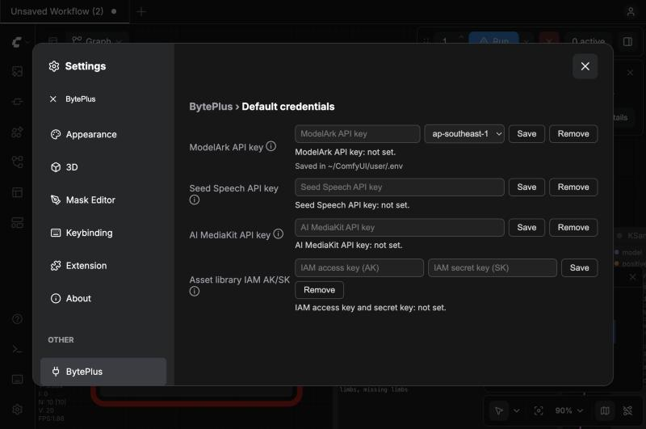
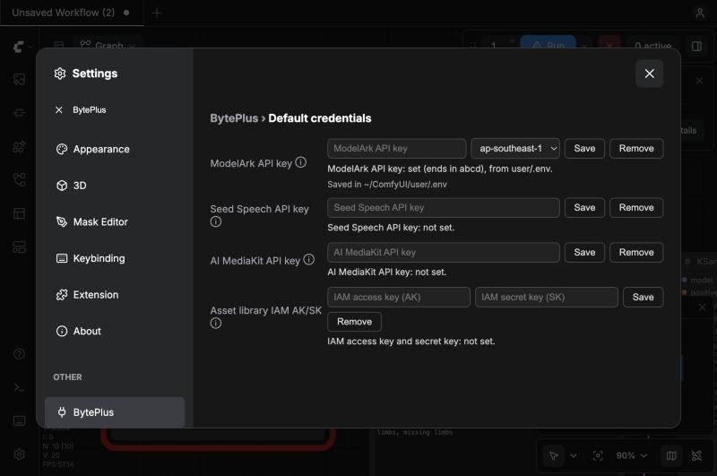
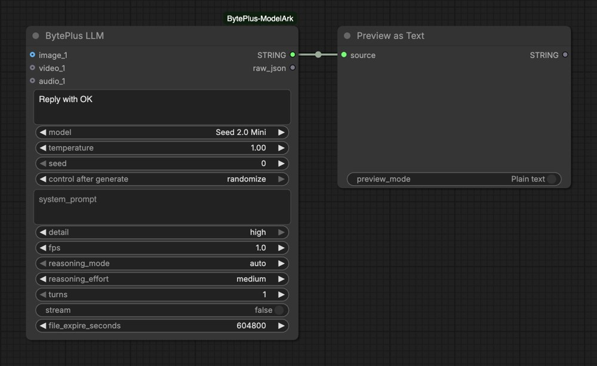

# ComfyUI BytePlus ModelArk

Use BytePlus models in ComfyUI with **your own BytePlus API keys**: Seedream images, Seedance videos, Seed / DeepSeek / GLM language models, Seed Speech audio, and AI MediaKit video and image enhancement.

Calls go straight to BytePlus and are billed to your BytePlus account (contract pricing and resource packs apply). No Comfy credits are used.

> **Status: v0.4.0.** Requires ComfyUI 0.31.0 or later. Works in Classic Canvas and Nodes 2.0.

## Contents

- [Quick Start](#quick-start)
- [What's Included](#whats-included)
- [API Keys](#api-keys)
- [Node Reference](#node-reference)
- [Guides](#guides): reference videos, links and assets, private assets, draft mode
- [Example Workflows](#example-workflows)
- [Development](#development)

## Quick Start

**1. Install.** In ComfyUI-Manager, search for *BytePlus ModelArk*. Or by hand:

```bash
cd ComfyUI/custom_nodes
git clone https://github.com/byteplus-sa/ComfyUI-BytePlus-ModelArk
pip install -r ComfyUI-BytePlus-ModelArk/requirements.txt
```

Run `pip` with the Python that runs ComfyUI, then restart ComfyUI. If the BytePlus SDK is missing or too old, the nodes don't load and the console prints the install command.

**2. Add your key.** Create a key in the [ModelArk console](https://ai.byteplus.com/ark/region:ap-southeast-1/apikey) and activate the models you want (keys and models are per region). In ComfyUI open **Settings → BytePlus**, paste the key, pick its region and press **Save**. No restart needed.

**3. Run a template.** Open the template browser, pick a BytePlus workflow and press **Run**. Connect `Save Image` / `Save Video` to keep results.

## What's Included

| Service | Nodes | Key |
|---|---|---|
| **ModelArk** – images | Seedream 4.5 & 5.0, Seedream 5.0 Layer Separation | ModelArk API key |
| **ModelArk** – video | Seedance 1.0 (3 nodes), Seedance 2.5 (3 nodes), Draft to Final | ModelArk API key |
| **ModelArk** – language | BytePlus LLM (Seed 2.x, DeepSeek, GLM) | ModelArk API key |
| **ModelArk** – asset library | Create Image / Video / Audio Asset, Asset Library | ModelArk API key + IAM AK/SK |
| **Seed Speech** | Seed Audio 1.0, Seed Speech TTS, Seed Speech ASR, Seed Voice Clone | Seed Speech API key |
| **AI MediaKit** | vCube Video Enhance, Video Smoothness Enhance, Image Quality Enhance | AI MediaKit API key |

The image, video, LLM and asset nodes match ComfyUI's built-in ByteDance nodes input for input, but use BytePlus model IDs. This pack's extras (parallel generations, non-blocking runs and so on) sit under each node's advanced inputs.

**Good to know**

- **Nodes only run when their output is used.** They save nothing themselves: connect `Save Image` / `Save Video`. A node with nothing connected doesn't run and isn't billed.
- **Regions:** `ap-southeast-1` (default) or `eu-west-1` for ModelArk. Seedream 5.0 Lite isn't available in `eu-west-1`. Seed Speech and AI MediaKit run in `ap-southeast-1` only.
- **Comfy.org login** is needed for a few features that upload local media to Comfy.org storage (BytePlus only accepts links there): Seedance reference videos, standard ASR, MediaKit sources and new private assets.

## API Keys

Each BytePlus product has its own key; they are not interchangeable.

| Key | Where to create it | Used by | `.env` variable |
|---|---|---|---|
| ModelArk API key | [ModelArk console](https://ai.byteplus.com/ark/region:ap-southeast-1/apikey) | Image, video, LLM and asset nodes | `BYTEPLUS_API_KEY` (+ `BYTEPLUS_REGION`) |
| Seed Speech API key | [Seed Speech console](https://console.byteplus.com/voice/new/overview?projectName=default) → Settings → API Keys (activate the services first) | Speech nodes | `BYTEPLUS_SEED_SPEECH_API_KEY` |
| AI MediaKit API key | [AI MediaKit console](https://console.byteplus.com/vodpaas/region:vodpaas+ap-southeast-1/ai-mediakit/settings?tab=apiKey) → Settings → API key | Enhancement nodes | `BYTEPLUS_VOD_MEDIAKIT_API_KEY` |
| IAM AK/SK | IAM console (a sub-user allowed only the asset library) | Asset library nodes | `BYTEPLUS_ACCESS_KEY`, `BYTEPLUS_SECRET_KEY` (+ `BYTEPLUS_SESSION_TOKEN` for STS) |

### Option A: Settings → BytePlus (recommended)

Open **Settings** (gear icon, or Ctrl+, / Cmd+,), search for **BytePlus**, paste a key and press **Save**.

- ModelArk keys are checked against BytePlus first; a wrong key is refused and nothing is saved.
- Keys are written to `user/.env` in your ComfyUI folder and take effect immediately.
- Settings only ever shows whether a key is set and its last four characters. The row also shows where the file is (*Saved in ~/…/user/.env*).





### Option B: Edit `user/.env`

Create `user/.env` inside your ComfyUI folder and add only the lines you need:

```
BYTEPLUS_API_KEY=your-modelark-key
BYTEPLUS_REGION=ap-southeast-1
BYTEPLUS_SEED_SPEECH_API_KEY=your-seed-speech-key
BYTEPLUS_VOD_MEDIAKIT_API_KEY=your-mediakit-key
BYTEPLUS_ACCESS_KEY=your-iam-ak
BYTEPLUS_SECRET_KEY=your-iam-sk
```

The file is read on every run, so no restart is needed. A real environment variable with the same name wins over the file (Settings tells you when that happens). The pack never touches other lines in the file.

<details>
<summary><b>Where is <code>user/.env</code>? Tips for creating it by hand</b></summary>

The quickest way to find it: **Settings → BytePlus** shows the path under the ModelArk row. ComfyUI also prints the folder at startup (`** User directory: …`). For ComfyUI Desktop it is inside the base folder you chose at install:

- macOS: `~/ComfyUI-Installs/<install name>/ComfyUI/user/.env`
- Windows: `<base folder>\ComfyUI\user\.env`

The file doesn't exist until you save a key.

- **macOS:** in Terminal, `nano <path>`, paste the lines, then Ctrl+O, Enter, Ctrl+X, and `chmod 600` the file. Finder hides dot-files (Cmd+Shift+. shows them); in TextEdit choose Format → Make Plain Text first.
- **Windows:** in Notepad choose *Save as type: All files* and name it `.env`, or it is saved as `.env.txt`.

**ComfyUI Desktop's Environment Variables field** (in each installation's settings) also works and wins over `.env`, but Desktop stores those values unencrypted and advises against putting keys there. Prefer Settings → BytePlus.

</details>

### Check that it works

Add **BytePlus LLM**, type `Reply with OK`, pick **Seed 2.0 Mini**, connect its output to **Preview as Text** (*Preview Any* in older ComfyUI) and press **Run**. It costs a few tokens.



Change the prompt or seed between test runs: ComfyUI reuses the cached result of an unchanged node, so an identical run makes no new request.

### Troubleshooting

| Symptom | Fix |
|---|---|
| No BytePlus page in Settings | Update the pack (ComfyUI-Manager → Update), restart ComfyUI and reload the page. |
| *Invalid API Key (401)* | The key and region don't match. Pick the key's region in Settings (or set `BYTEPLUS_REGION`). |
| *No BytePlus API key found…* | No key is set. Save one in Settings or `.env`. |
| *Invalid X-Api-Key* on speech nodes | You used a ModelArk key. Seed Speech needs its own key. |
| Save says *Requests from another origin are not accepted* | ComfyUI is behind a proxy that hides the address you opened. Edit `.env` by hand. |

### Keep your keys safe

- Never commit `user/.env`. Settings creates it readable by you only.
- ComfyUI has no login: anyone who can open your ComfyUI page (for example with `--listen` on a shared network) can use your keys and replace them in Settings. Don't expose ComfyUI to networks you don't trust.

## Node Reference

Model names map to dated model IDs in [`nodes/models_config.py`](./nodes/models_config.py). Activate each model in the ModelArk console for the region you use.

### Image (ModelArk)

| Node | What it does |
|---|---|
| **Seedream 4.5 & 5.0** | Text-to-image and image editing with Seedream 5.0 Pro, 5.0 Flash, 5.0 Lite, 4.5 and 4.0. |
| **Seedream 5.0 Layer Separation** | Splits one image into a base image and up to 16 transparent layers (5.0 Pro or Flash). |

**Seedream 4.5 & 5.0**
- Sizes: presets for 1:1, 3:4, 4:3, 16:9, 9:16, 2:3, 3:2 and 21:9 at each supported resolution (5.0 Pro and Flash add 1.5K, priced like 1K on Pro); "adaptive" levels where the model picks the ratio; or a custom width × height from 1:16 to 16:1.
- Up to 10 reference images (14 on 5.0 Lite). `max_images` for related image sets (Lite, 4.5, 4.0). Prompt optimization and "thinking" where supported.
- Advanced: parallel generations, PNG output, transparent background on Pro and Flash (connect Load Image's `MASK` to `reference_mask`; the `mask` output holds the result's transparency).

**Seedream 5.0 Layer Separation** outputs the base image and mask, each layer and its mask, bounding boxes, a `layer_stack` for Create Layered Image, and a JSON list of layer names and descriptions. Its opt-in `save_layers` is the only setting in the pack that writes files itself.

### Video (ModelArk)

| Node | Models | Highlights |
|---|---|---|
| **Seedance Text to Video**, **Image to Video**, **First-Last-Frame to Video** | `seedance-1-0-pro`, `seedance-1-0-pro-fast` (First-Last-Frame: Pro only) | 480p–1080p, 2–12 s, `camera_fixed`, `watermark` |
| **Seedance 2.5 Text to Video**, **First-Last-Frame to Video**, **Reference to Video** | 2.5 (1080p, 30 s), 2.5 Premium (4K, whitelist only), 2.0 (4K), 2.0 Fast, 2.0 Mini | Draft options for 2.5 and 2.5 Premium; `output_format` mp4 / mov on 2.5 |
| **Seedance 2.5 Draft to Final Video** | Reads the model from the draft | See [Draft Mode](#draft-mode) |

- **Reference to Video** takes up to 50 references on 2.5 (30 images, 10 videos, 10 audio clips) and 15 on 2.0 (9 + 3 + 3), connected or as `asset_N` [links or assets](#reference-links-and-assets). `task_type`: auto / reference / edit / extend. Reference videos can be down- or upscaled.
- **Batches:** with `generation_count` above 1, every video reaches the `VIDEO` output (each with its own seed; the next node runs once per video), and `last_frame` holds their last frames as one batch.
- **Advanced:** offline inference, parallel generations, non-blocking runs.

### Language (ModelArk)

**BytePlus LLM** answers in text with Seed 2.0 Pro / Lite / Mini, Seed 2.1 Turbo, DeepSeek V4.1 Flash or GLM 5.3 Flash.

- Context: up to 20 images and 4 videos. Seed 2.0 Lite and Mini also take up to 4 audio clips (120 minutes in total); the other models can't hear audio.
- Temperature and system prompt. Advanced: image detail, video fps, deep thinking with effort from minimal to max, multi-turn conversations and streaming. A second output returns the raw response JSON.

### Asset Library (ModelArk)

Needs Dreamina Seedance Advanced Creation Rights and IAM AK/SK. See [Private Assets](#private-assets).

| Node | What it does |
|---|---|
| **Create Image Asset**, **Create Video Asset**, **Create Audio Asset** | Adds media (connected, or an HTTPS link) to an asset group and outputs `asset_id`, `group_id` and an `asset://` URI. |
| **Asset Library** | Lists your assets (virtual portraits or verified real people) as `asset://` URIs. |

### Speech (Seed Speech)

| Node | What it does |
|---|---|
| **Seed Audio 1.0** | Speech, voiceovers, music and sound effects up to 120 s from a prompt, in 20 languages. |
| **Seed Speech TTS** | Text to speech with TTS 2.0 voices, TTS 1.0 speakers or cloned voices. |
| **Seed Speech ASR** | Speech to text in 50+ languages, with timings and SRT subtitles. |
| **Seed Voice Clone** | Trains a cloned voice from a 10–15 s clip and outputs its `speaker_id`. |

**Seed Audio 1.0** (`seed-audio-1.0`)
- `reference_mode`: text only; audio reference (up to three clips of up to 30 s, or speaker IDs / cloned voice IDs / URLs, referred to as `@Audio1`–`@Audio3` in the prompt); image reference; or a preset TTS 2.0 voice.
- Sample rate, speed, loudness and pitch. Advanced: wav / mp3 / ogg_opus / pcm, sentence or word subtitles, audible and metadata watermarks.
- `generation_count` runs up to 16 takes of the same prompt in parallel. **Each take is billed separately** (the API has no seed). Outputs are lists in the same order; failed takes are skipped unless all fail.

**Seed Speech TTS**
- Models: `seed-tts-2.0` (voice list), `seed-tts-1.0` (speaker IDs), `seed-icl-2.0` / `seed-icl-1.0` (cloned voices).
- Style instructions (`context_text`), emotion and intensity, speed, volume, pitch, sample rate, language, trailing silence, subtitles and timestamps.
- Advanced: language detection, Markdown / emoji / LaTeX / parentheses handling, 1-hour cache, tone fidelity for cloned voices.

**Seed Speech ASR**
- `seed-asr-fast` sends a connected clip inline. The standard models (`seed-asr-2.0` / `1.0`, up to 5 h) only take URLs, so a connected clip is uploaded to Comfy.org storage first (**Comfy.org login required**); or pass a public audio URL.
- Punctuation, number formatting, filler-word removal, speaker labels and hotwords. Advanced (ASR 2.0): dialogue context and an image for visual context, language detection, stereo channel split, silence-based segmentation, Traditional Chinese output, sensitive-word filtering.

**Seed Voice Clone** (Voice Replication 2.0)
- Trains into a voice slot (`S_…`, bought in the Seed Speech console) or a postpaid custom voice ID, waits until it's ready, and outputs `speaker_id` plus a demo clip.
- Use the `speaker_id` with TTS model `seed-icl-2.0` (`custom_speaker_id`) or in a Seed Audio reference slot.
- Each slot can be trained 15 times. **The first TTS call with the voice starts the slot's billing.**

### Video and Image Enhancement (AI MediaKit)

Connected videos and images are uploaded to Comfy.org storage first (**Comfy.org login required**); the advanced `video_url` / `image_url` inputs take a public link instead. MediaKit result links expire after 24 hours, so the nodes download results right away.

| Node | What it does |
|---|---|
| **vCube Video Enhance** | Super-resolution up to 8K, artifact and noise removal, frame interpolation up to 120 fps. |
| **Video Smoothness Enhance** | Repairs stutter and removes duplicate frames without changing the resolution (for example in Seedance videos). |
| **Image Quality Enhance** | Upscales and restores images: super-resolution, denoising, deblurring, sharpening, portrait / text / colour enhancement. |

**vCube Video Enhance** (same inputs as ComfyUI's built-in vCube node)
- `standard` (scene presets `aigc`, `common`, `ugc`, `short_series`, `old_film`) or `professional`; `hd` or `natural` style; resolution preset, `source` or custom short side; `fps` and `bitrate_level`.
- Sources up to 2560×1440 and 10 minutes.
- Also outputs a before/after **comparison video** (sweeping divider) and a `source_frame` / `enhanced_frame` pair for ComfyUI's `Compare Images` slider (Nodes 2.0 only).
- Advanced: exact `bitrate`, `comparison` on/off, `compare_time`.

**Video Smoothness Enhance**
- `periodic_stutter`: `repair` (generates in-between frames; `align_source_fps` keeps the frame rate and duration, `insert_frame_indices` forces insertions) or `detect only`. `duplicate_frames`: `remove` or `detect only`.
- Sources up to 4K, and up to 35 s while a repair is on (detection alone has no length limit).
- Outputs the repaired video, a **side-by-side comparison video**, and the stutter and duplicate-frame counts. If MediaKit repairs nothing, the source passes through, no comparison is made, and the task is billed as detection only.

**Image Quality Enhance**
- `tool_version`: `standard` (up to 8x, PNG output), `professional` or `max` (generative, up to 30x, with `generative_enhance_mode` `generative_first` / `fidelity_first`; `max` adds `enable_correct_color`).
- `output_size`: a `multiple` (default 2x) or a `target size`. Size limits are checked before upload. Each image in a batch is enhanced separately.
- Also outputs `original` (the input resized to the result's size) for the `Compare Images` slider.

## Guides

### Reference Videos

Seedance only accepts reference videos as URLs, so videos connected to `Reference to Video` are uploaded to Comfy.org storage first.

- Requires a **Comfy.org login** (or Comfy.org API key) in ComfyUI, and doesn't work with `--disable-api-nodes`.
- Uploads are deleted after about 24 hours; the pack reuses an upload for up to 12 hours.
- To skip the upload, pass a link or asset instead (below).

Connected images and audio are sent inline; nothing is uploaded.

### Reference Links and Assets

`Reference to Video` has `asset_N` inputs, and `First-Last-Frame to Video` has `first_frame_asset_id` / `last_frame_asset_id`. Each takes either:

- an asset ID or `asset://<ASSET_ID>` from your private asset library (for example the `asset_id` output of `Create Image Asset`), or
- a public `https://` link to an image, video or audio file (type it into a String node and connect it).

For `asset_N`, links are recognized by file extension or content type; asset IDs are looked up in the asset library, which needs IAM AK/SK.

**In the prompt**, refer to references by position (*Image 1*, *Video 1*, …): connected inputs come first, then `asset_N` entries. You can also write `asset1`, `asset2`, … and the node replaces them with the matching position.

### Private Assets

With **Dreamina Seedance Advanced Creation Rights** you can keep authorized media, such as virtual portraits or verified real people, in a private asset library and use it in Seedance 2 / 2.5.

**Setup:** save IAM AK/SK with asset-library permission in **Settings → BytePlus** ("Asset library IAM AK/SK") or in `.env`. Use an IAM sub-user whose policy only allows the asset library. STS session tokens can only be set in `.env` (`BYTEPLUS_SESSION_TOKEN`).

**Create and use an asset:**

1. Add `Create Image Asset` (or Video / Audio). Connect the media or set a public HTTPS URL.
2. Set an existing `group_id` (for example a real-person group from the ModelArk console), or leave it empty and set `group_name` to find or create a virtual-portrait group.
3. Run. The node waits until the asset is **Active** and outputs `asset_id`, `group_id` and `asset_uri`. Re-running with the same image reuses the asset.
4. Connect `asset_id` to an `asset_N` input of `Seedance 2.5 Reference to Video` (or `first_frame_asset_id` on First-Last-Frame).

**Good to know**

- **Real people:** BytePlus verifies real people only in the ModelArk console (a QR-code invitation; see [Add real-human assets](https://ai.byteplus.com/ark/region:ap-southeast-1/docs/upload-real-person-portrait-assets)). Create those groups there and pass their `group_id`.
- **Existing assets:** `Asset Library` lists them. Using an asset in Seedance only needs the API key, except `asset_N` looks up the asset's type with AK/SK.
- **Uploads:** connected media is uploaded to Comfy.org storage first (Comfy.org login required); a URL input skips the upload.
- **Rate limits:** Entry 3, Advanced 120, Premium 300 `CreateAsset` requests per minute.
- Only use media you are authorized to use.

### Draft Mode

Seedance 2.5 can render a quick 480p draft before the full-quality video:

1. On a Seedance 2.5 node pick `Seedance 2.5 Draft` or `Seedance 2.5 Premium Draft`, set the seed control to **fixed**, and run. The node outputs `draft_task_id`.
2. Connect `draft_task_id` to `Seedance 2.5 Draft to Final Video` (or paste IDs, one per line) and run again. The draft node isn't re-run while its inputs are unchanged, so the final uses the draft you reviewed.

The final reuses the draft's prompt, references, duration, aspect ratio, seed and audio setting, and renders at 1080p (2.5) or 4K (2.5 Premium). Draft task IDs are valid for 7 days.

## Example Workflows

Templates are in [`example_workflows/`](./example_workflows) and appear in ComfyUI's template browser: one per node, `2.5 Model Updates` (Seedream, Seedance 2.5 and the LLM together), plus pipelines that chain services:

| Template | What it does |
|---|---|
| Text to Image to Video | Seedream makes the first frame, Seedance animates it. |
| Seedance Video Extension | Three Seedance clips, each starting from the previous clip's `last_frame`, joined into one video (needs ComfyUI 0.36+ for `Concatenate Video`). |
| Seed Prompt Writer | The LLM turns a short idea into a detailed Seedream prompt. |
| Generate and Enhance | Seedream → Image Quality Enhance; Seedance → vCube Video Enhance (ModelArk + MediaKit keys). |
| Private Asset Library | Uses a private asset as an `asset_N` reference in Seedance 2.5 (IAM AK/SK + Advanced Creation Rights). |

## Development

```bash
# Template tests (no ComfyUI needed)
python3 -m unittest tests.test_workflow_templates

# Node tests (need a ComfyUI checkout and a Python with torch and the BytePlus SDK; skipped otherwise)
COMFYUI_ROOT=/path/to/ComfyUI python -m unittest tests.test_model_updates tests.test_workflow_templates tests.test_core_style_seedance1 tests.test_core_style_seedance2 tests.test_core_style_seedream tests.test_core_style_seed tests.test_mediakit tests.test_credentials
```

CI runs both on every push and pull request, and weekly against ComfyUI's latest release and `master`, since the nodes are compared with ComfyUI's built-in ByteDance nodes. See [`CLAUDE.md`](./CLAUDE.md) for layout and conventions.

**Planned:** optional reference video upload via your own object storage (TOS or S3, presigned URL).

## License

[MIT](./LICENSE)
